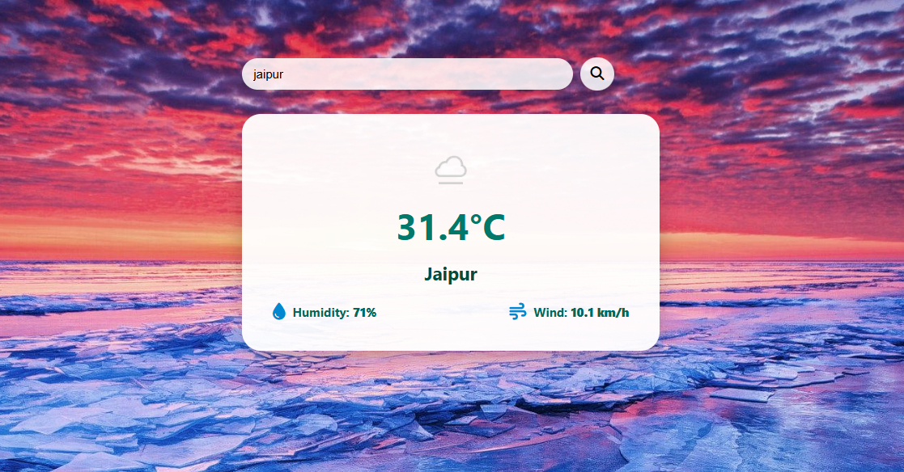

# 🌦️ Weather App

A responsive and user-friendly weather application built using **HTML**, **CSS**, and **JavaScript**. The app allows users to search for any city and displays real-time weather data using a third-party weather API.

---

## 🚀 Features

- 🔍 Search weather by city name
- 🌡️ Shows temperature, humidity, and wind speed
- 🌤️ Dynamic weather icon based on current conditions
- 🎯 Clean, modern, and mobile-responsive UI
- 🖼️ Background image support for better aesthetics

---

## 📸 Screenshot

> _(Add a screenshot named `weather_screenshot.png` in your repo)_



---

## 🔧 Technologies Used

- HTML5
- CSS3
- JavaScript (ES6)
- [WeatherAPI.com](https://www.weatherapi.com/) for real-time weather data

---

## 📁 Folder Structure

```bash
weather-app/
├── index.html         # Main HTML file
├── style.css          # All styling
├── script.js          # JS logic for API and UI update
├── weatherimg.jpg     # Background image
└── README.md          # This file
